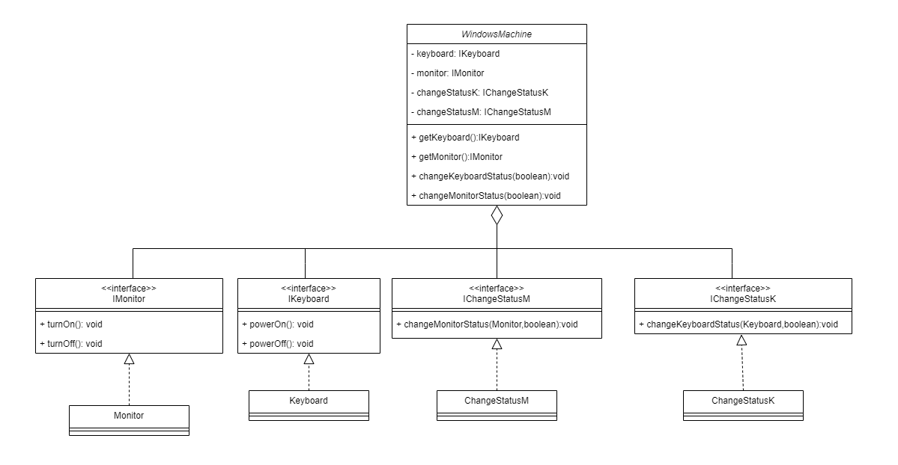

## Dependency Inversion Principle:

The DIP states that high-level modules should not depend on low-level modules; both should depend on abstractions. 
Abstractions should not depend on details.

In this example the WindowsMachine class depend on concrete classes, not on abstractions class -> that cause violets the principle.
I'm creating the two interfaces (IKeyboard, IMonitor).
That makes the WindowsMachine class depend on interface.

Also, to make the code not open to modify, create two classes to change the status to Keyboard and Monitor. And create for each of class -> interface.

