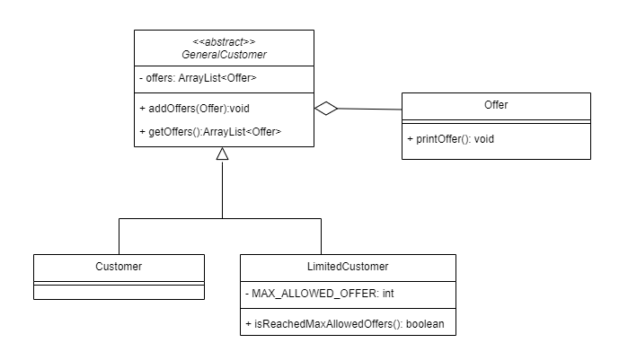

## Liskov Substitution Principle:

This principle mean -> what we want is to have the objects of our subclasses behaving the same way as the objects of our superclass.

In this example the LimitedCustomer extend of the Customer,
and each of them have the addOffer method, this makes when replacing the superclass with subclass not behave the same way.

Because of that we create the General Class (abstract class) contain abstract addOffer method, and each of the Customer & LimitedCustomer will have its own implement for this method.

