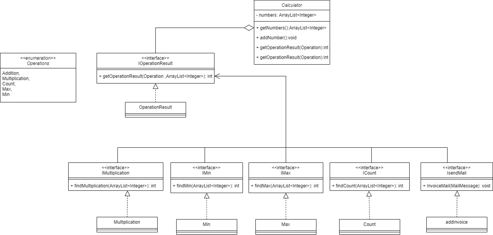

## Open-Closed Principle:

This principle make the code open for extension but closed for modification.

In the Calculator class we have getOperationResult() method that have all the operations the code supported, that mean if we want to add another operation we should make changes in the Calculator class -> make modification in the class.
this mean we violets the Open-Close principle.
Because of that I create the OperationResult class to put all code that maybe changes. also, create the interface to make the class depend on interface class not concrete.

The operation enum put it in constant package, if we need to add on them just modify in this class.

Also, I put each operation in specific class, because if we need add other operation just add classes not modify our code. 

