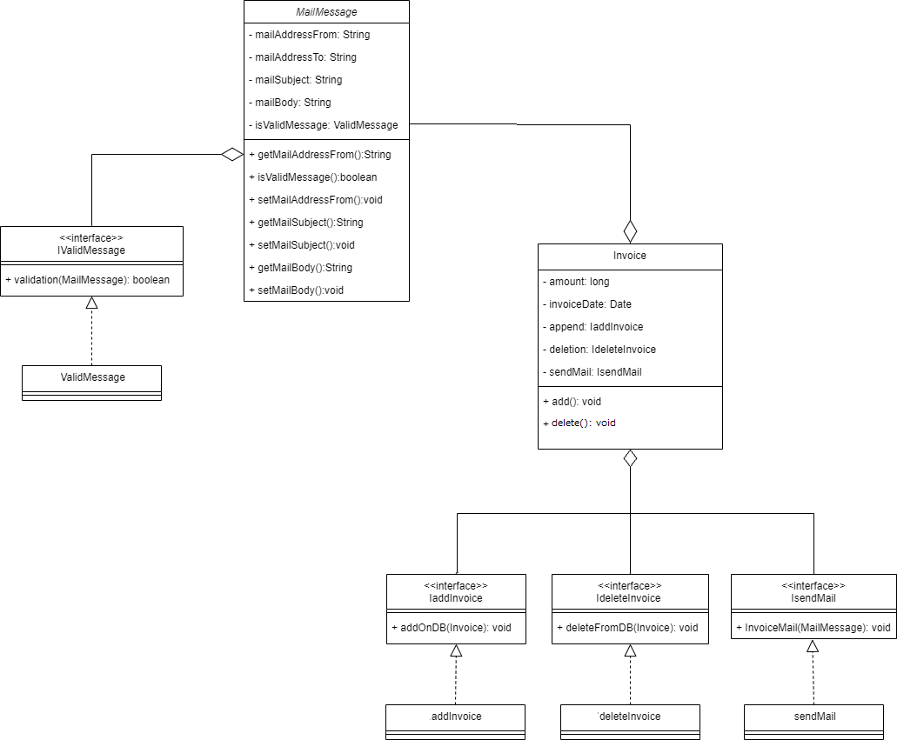

## Single Responsibility Principle:

Invoice class do more than thing like add and delete the Invoice -> 

connection on the database -> insert on database -> close connection

also, do : the connection with user like -> send mail to the user.

become of that the class violate this principle,

I make for each process single class and interface for each one -> to make the class depends on Interface not on concrete class.

When I make this if someone need to make any change in the code -> make the change only in a specific class not in the Invoice class.

